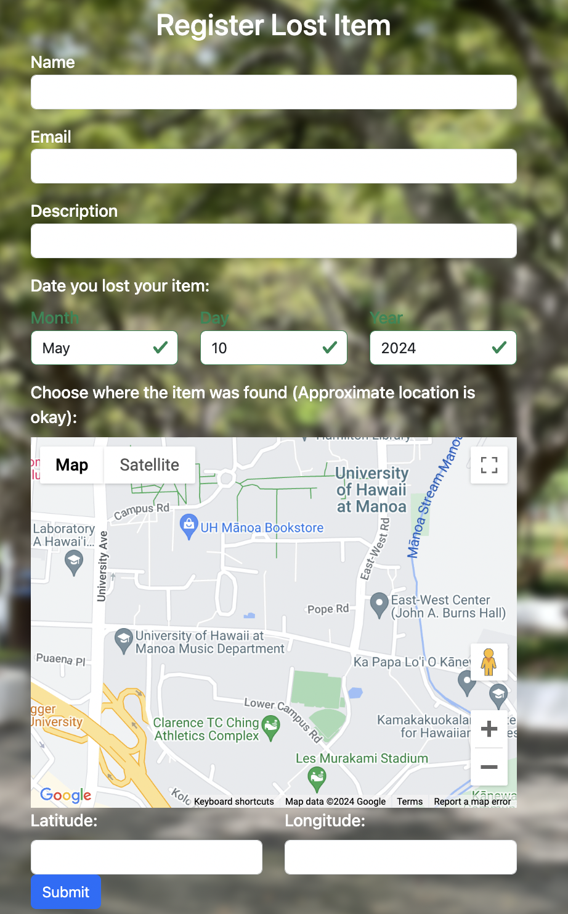

# Project Overview
Manoa Reclaim is a web app intended to serve as a centralized lost and found platform for the community of the University of Hawaii at Manoa. An in depth guide to the projects purpose, development, and implementation can be found at the [Manoa Reclaim Project Page](https://manoa-reclaim.github.io/). Additionally the source code can be found [here](https://github.com/manoa-reclaim/Manoa-reclaim-app)

# My Role in Manoa Reclaim
My main contributions to the app were implementing a form for people to register a lost item in the database when they find something that is lost. 

*screenshot of form to register lost items*

I also implemented an edit button that allowed admins to edit all of the information about the items in the database as well as allowing students to edit items that they submitted. Another component which I added was a delete button which allows admin to delete items from the database. Lastly I managed the deployment of the web app at [Manoa Reclaim](https://manoareclaim.online/).

# What I've Learned from Developing Manoa Reclaim
This project has allowed me to grow immensly as a developer. I have learned about problem solving, dessign patterns, software engineering, and working on a team. I think my greatest takeaways have been from working a team and learning to manage work distribution, communication, and learning to contribute to a large codebase seamlessly. 

