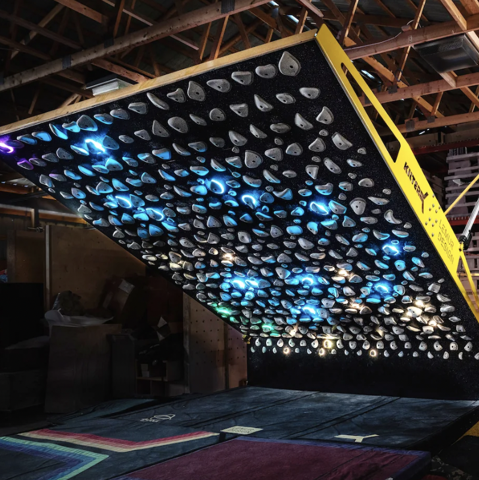

I work with the routesetters at volcanic rock gym and to further expand the gym we have built a wall from scratch and constructed another wall which was made by a different company. The wall that the gym ordered uses RGB lights in order to show you what holds on the wall you are supposed to grab. I helped to wire the 300+ holds so that they light up properly according to the associated app. Essentially each hold has a position based on a grid and we needed to wire it so that the control box would be able to appropriately light up each hold based on what the user inputs into the app. 

Additionally I helped to construct a wall from scratch. We used 4 by 8 plywood sheets for the actual wall and 2 by 4s for the framework in the back. This project was difficult because it needs to be done properly in order to be safe. Additionally we needed to cut the wood very precisely in so that the wall could be mounted onto the frame at a slight angle of -5 degrees(assuming 0 degrees is perpendicular to the floor and the negative direction faces the back of the wall). 

These construction projects taught me a lot about how to work with people, think critically, and make collective decisions. In this process we were making decisions about what would best serve the community, provide the most profit for the gym, and be safe. This complicated things since there were so many factors and differing opinions about the best solutions for our problems
