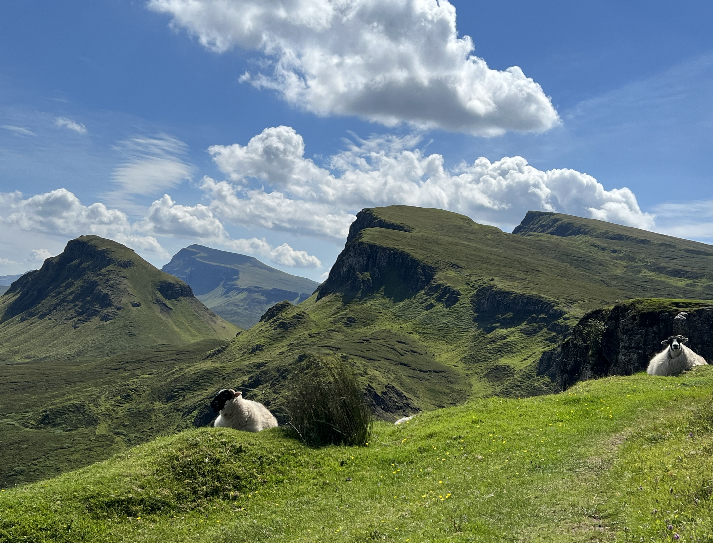
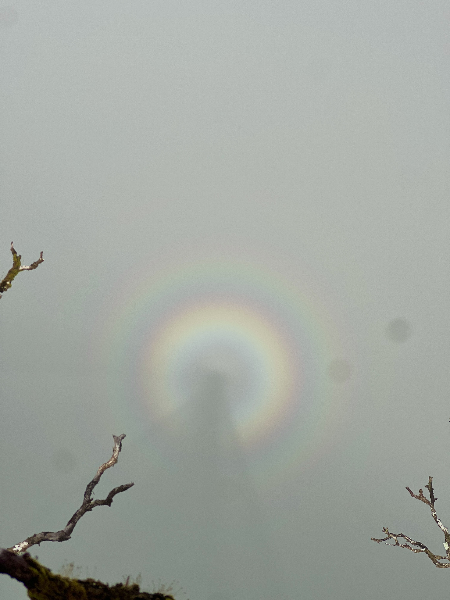

I started photography in highschool, and have been very into it since I took AP photo. I like to shoot film since you capture just one moment versus digital where you can take as many pictures as you want. I think this makes flim photography more special and unique as there is no room for error; the photos you get are exactly what you took whereas in digital photography you may have taken more than 10 photos in a single second and you can sift through to pick the best one which I think takes away from the point of photography; to capture a moment. This is a a few of my favorite recent photos from my photography portfolio.

  
  
  

